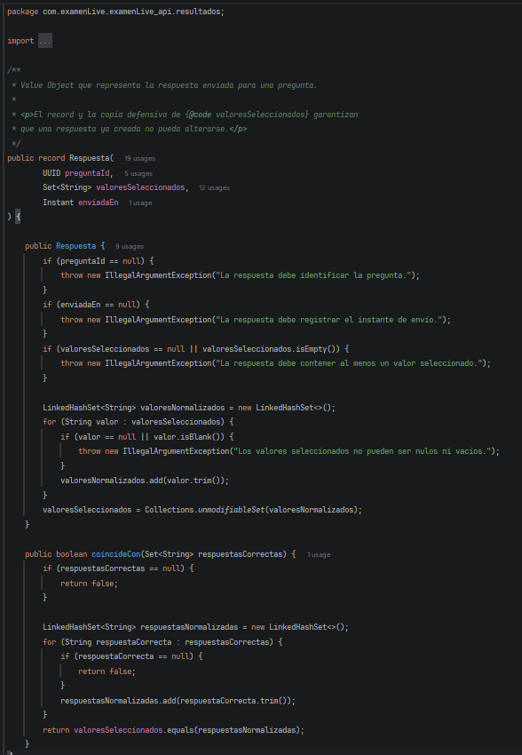
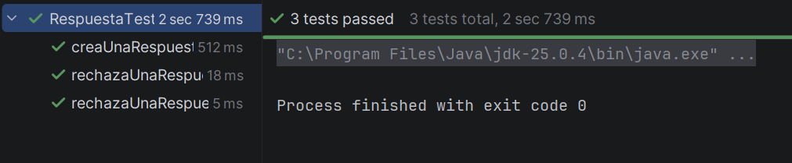
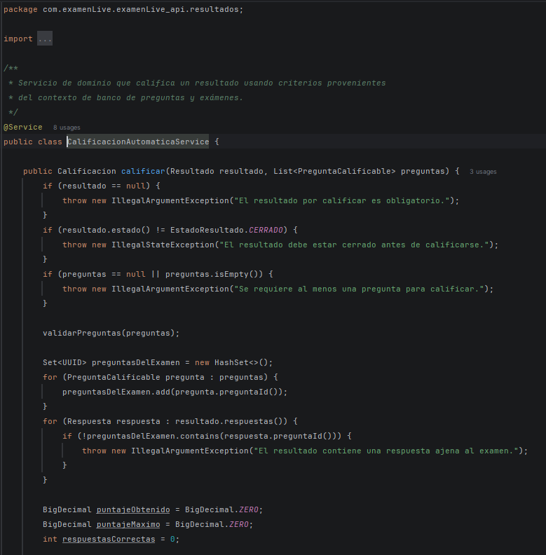
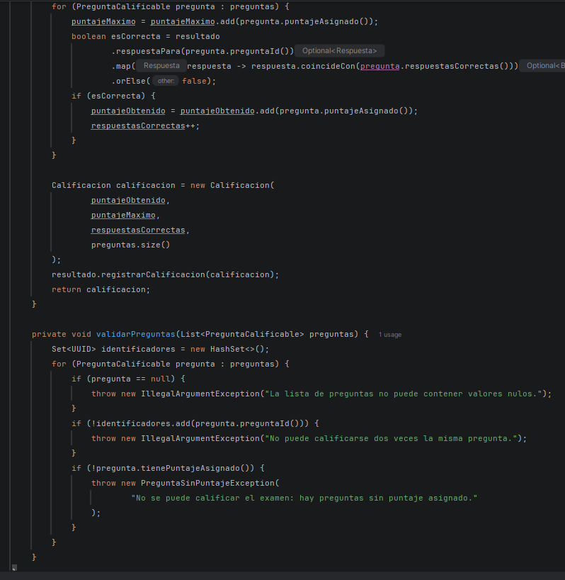
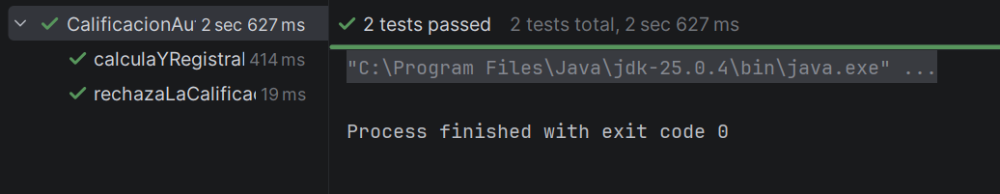
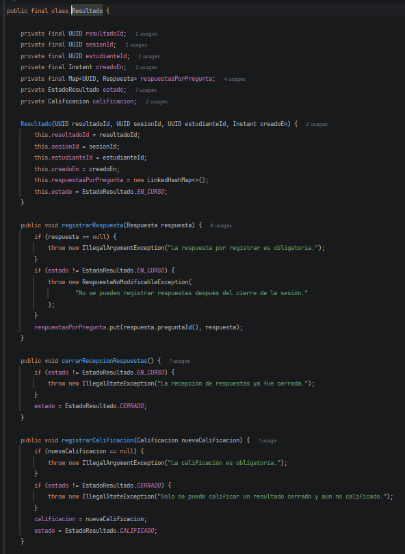
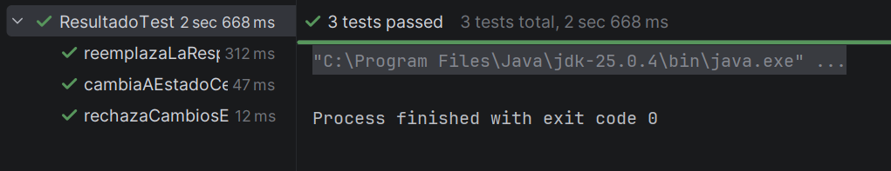
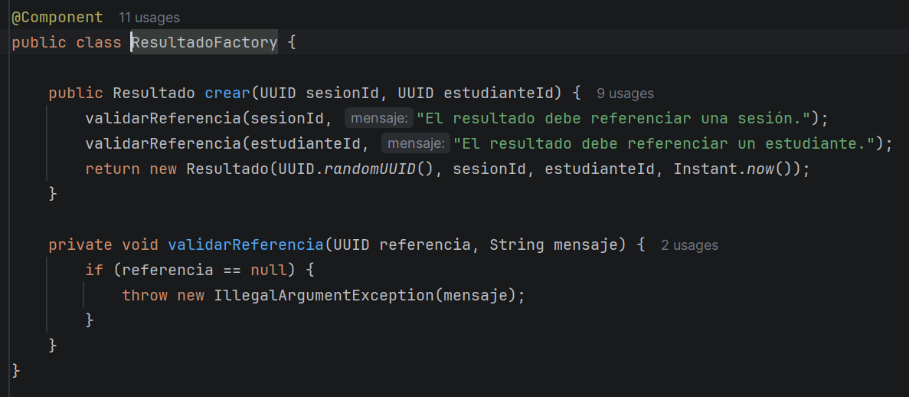
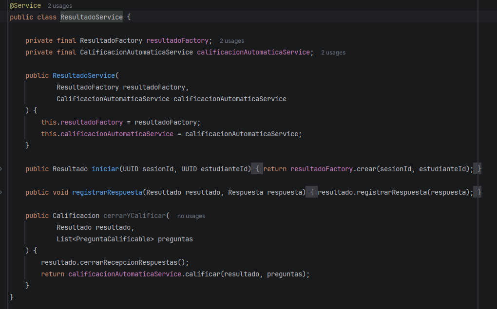
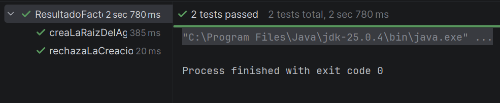

# Bitácora Dev 3 Calificación y Resultados

---
## Implementación DDD

Fecha de implementación: 17 de septiembre de 2026

Rama: `dev3-resultados-ddd`

Los tiempos reales corresponden a esta sesión de implementación asistida y se obtuvieron de las marcas de tiempo del archivo recibido.

| Paso | Actividad | Estimado |   Real |
| --- | --- | ---: |-------:|
| 1 | Auditar y documentar el lenguaje ubicuo | 20 min | 18 min |
| 2 | Construir el Value Object `Respuesta` | 45 min | 50 min |
| 3 | Implementar `CalificacionAutomaticaService` | 35 min | 48 min |
| 4 | Proteger el límite del agregado `Resultado` | 15 min | 19 min |
| 5 | Centralizar la creación en `ResultadoFactory` | 35 min | 32 min |
| 6 | Verificar, documentar y preparar el entregable local | 5 min | 10 min |

## Decisiones registradas

- Se adoptó vocabulario en español porque coincide con `Requisitos_G8`: `Resultado`, `Respuesta`, `registrarRespuesta`, `cerrarRecepcionRespuestas` y `calificar`.
- `Respuesta` es un `record`; además, realiza una copia defensiva del conjunto recibido para impedir mutaciones indirectas.
- `Resultado` es la raíz del agregado y controla todas las modificaciones de respuestas y calificación.
- Los contextos externos se referencian solo mediante `UUID`: `sesionId`, `estudianteId` y `preguntaId`.
- `PreguntaCalificable` es una proyección local, no una referencia al objeto `Pregunta` del contexto de exámenes.
- `CalificacionAutomaticaService` valida todas las preguntas antes de modificar el agregado, por lo que un rechazo no deja una calificación parcial.
- `ResultadoFactory` concentra la validación inicial, genera la identidad y construye la raíz completa.
- Se registraron la Factory y el Servicio de Dominio como componentes Spring, se agregó `ResultadoService` para delegar la creación y se reemplazó el runner auxiliar por pruebas JUnit, AssertJ y Mockito directas.

## Capturas solicitadas

| Paso | Clase o documento                                                             | Captura tests                                |
| --- |-------------------------------------------------------------------------------|----------------------------------------------|
| 1 | `evidencias_ddd/ddd-resultados.md`                                            |                                              |
| 2 |                                           |     |
| 3 |   |     |
| 4 |                                           |     |
| 5 |                                         |   |